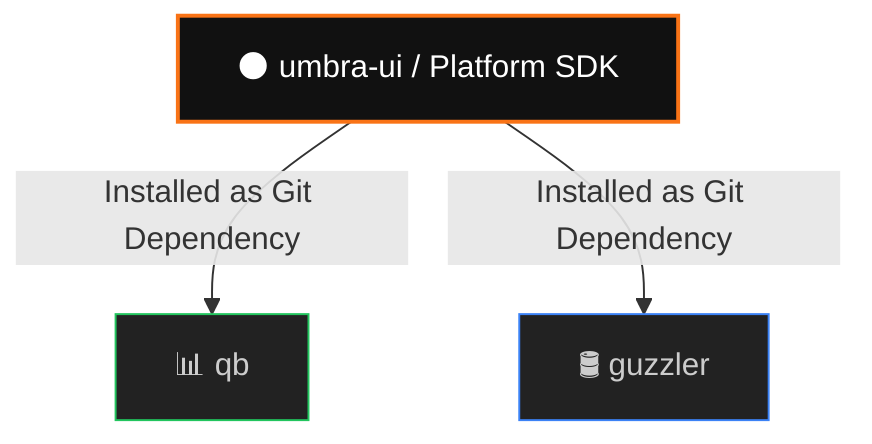

# 🌑 umbra

> **The Standard Operating Environment (SOE), Application Harness, and shared Platform SDK for our app ecosystem.**
> 
> *Fix or improve a design pattern once, here, and every consuming application automatically inherits it.*

---

## 👁️ The Vision

`umbra` is **not** a copy-paste dumping ground for primitive components. It is the centralized source of truth for design tokens, visual rhythm, and composite structural shells across all our downstream applications (like `qb` and `guzzler`).

By enforcing absolute structural discipline at the framework layer, we ensure that every app feels like a native extension of the same suite.


### Themes

- **Umbra** — Dark mode (default)
- **Lumen** — Light mode

## 📜 The Non-Negotiable Invariants

To guarantee mathematical visual alignment across all screens, every component and consuming layout must respect these physical laws:

### 1. Framework, Not Just Primitives
Do not assemble page shells or dialog layout wrappers out of raw HTML or ad-hoc Tailwind `div`s. Consume the structural layout modules directly:
* **`AppShell`**: Locks down the sidebar, header alignment, navigation trigger, and core layout canvas.
* **`SettingsDialogShell`**: A pre-built modal structure with navigation tabs, standard footer layout, and consistent geometry.
* **`SettingsTabSection`**: Standard header, title, and action positioning structure.

### 2. Strict Spacing Invariants & Vertical Rhythm
* **Zero Outer Margins on Text:** **NEVER** add top or bottom margins (`mt-*`, `mb-*`, `my-*`) directly to text elements (`h1`–`h6`, `p`, `label`). The line-height must strictly equal the bounding box height.
* **Containers Own Spacing:** Parent containers (flex/grid) control all spacing between elements using `gap-*` utilities.
* **Our Standard Spacing Scale:**
  - `gap-1` / `gap-2` (4px–8px): Tight pairings (e.g., Title + Subtitle, Label + Input).
  - `gap-4` (16px): Content stacks (e.g., forms, stacked paragraphs, tables).
  - `gap-6` / `gap-8` (24px–32px): Major layout divisions, dialog sections, panel padding.

### 3. Single Barrel Exports
All public components, utilities, and hooks must be re-exported via [`src/index.ts`](file:///home/jed/Github/umbra-ui/src/index.ts).

---

## 🚀 Quick Start

### 1. Installation
Install directly from GitHub. **Never copy-paste source files into a project.**

```bash
# Install the library into your project
npm install git+https://github.com/JedWag/umbra.git
```

> [!TIP]
> For active same-day development across the kit and a consuming app, you can temporarily use a local file path:
> `npm install file:../umbra`
> Just revert back to the GitHub URL before committing.

> [!NOTE]
> **Future direction:** once umbra is more developed/stable, this repo will move from a `git+https://...` dependency to a real published package on **GitHub Packages** (`@jedwag/umbra-ui`, scoped npm registry, semver-versioned via `npm version` + `npm publish`). That fixes the git-install restriction some machines have and gives consuming apps proper version pinning instead of always tracking `main`. Not done yet — keep using the git+https / temporary `file:` workflow above until this note is updated.

### 2. Stylesheet Setup
Include the design system styles in your app's root stylesheet right after Tailwind and base shadcn styles:

```css
@import "tailwindcss";
@import "tw-animate-css";
@import "shadcn/tailwind.css";
@import "umbra/theme.css"; /* 🌑 Enforces the Umbra + Lumen design tokens */
```

### 3. Theme Provider
Wrap your application root with `ThemeProvider` to provide standard theme storage and support switching between **Umbra** (default dark mode) and **Lumen** (light mode).

```tsx
import { ThemeProvider, Toaster } from "umbra"

function App() {
  return (
    <ThemeProvider storageKey="myapp-theme" defaultTheme="umbra">
      {/* ... Your Application ... */}
      <Toaster />
    </ThemeProvider>
  )
}
```

### 4. Import Components
Import pre-styled, SOE-compliant components directly:
```tsx
import { Button, Card, Dialog, DialogFooter } from "umbra"
```

---

## 🛠️ Development Workflow

### Local-First, Promote Later
1. **Audit Existing Work:** Check if a layout pattern or component already exists in `umbra`.
2. **Build Locally:** If exploring a brand-new component, build it locally inside the specific consuming project (`qb` or `guzzler`).
3. **Design for Promotion:** Write local components with clean, self-contained props/slots. When stable, promote the component back to `umbra` and update the dependency in the app.

### Adding shadcn Primitives
To extend the kit, run the shadcn CLI inside the root of this repository:
```bash
npx shadcn add <component>
```
Remember to add the exports to [`src/index.ts`](file:///home/jed/Github/umbra-ui/src/index.ts).
